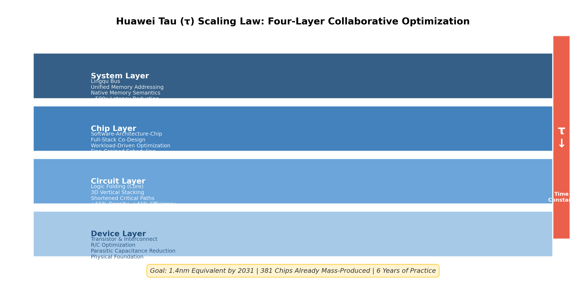
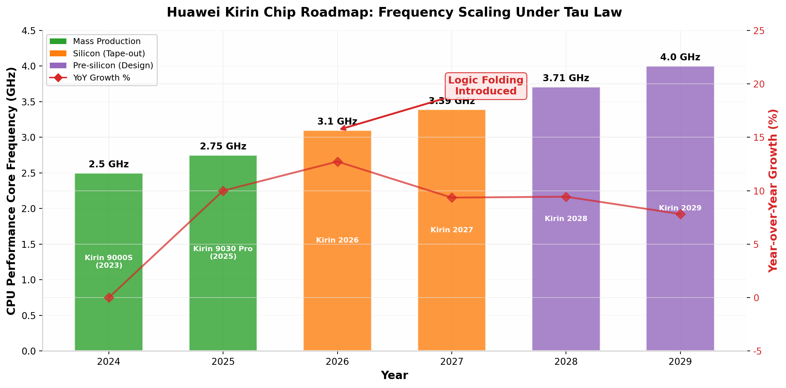
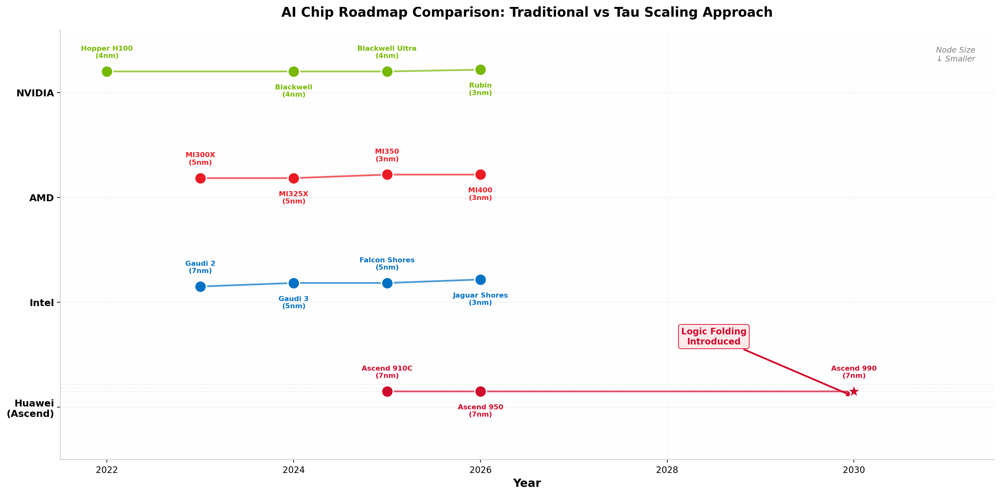
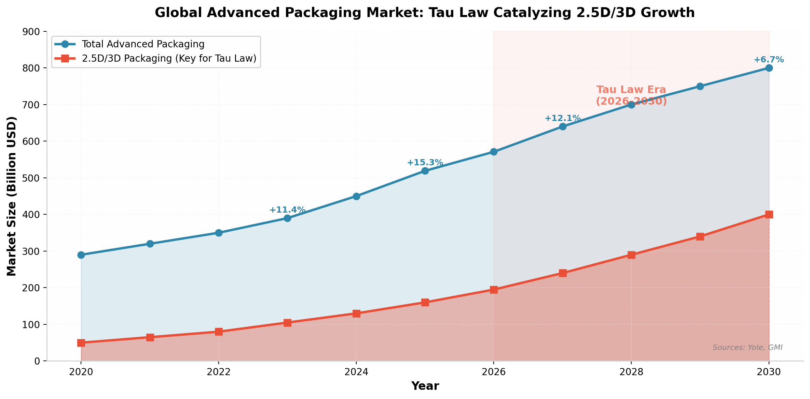
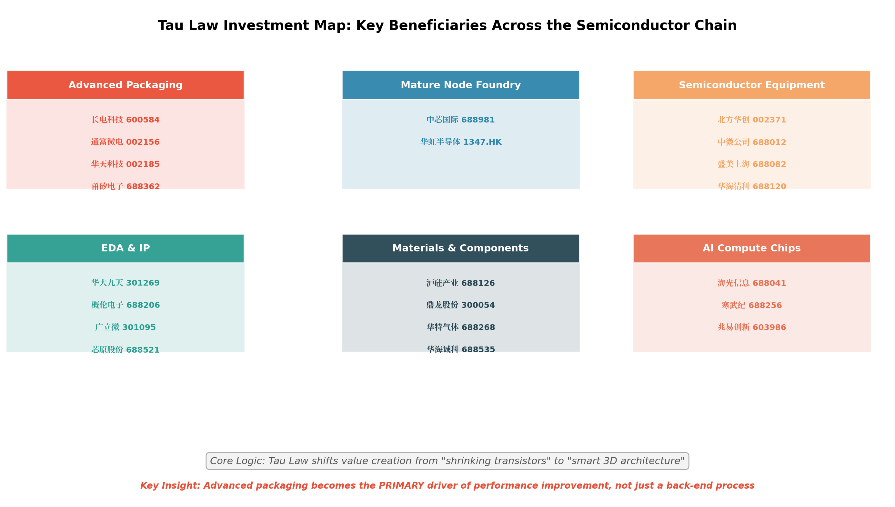
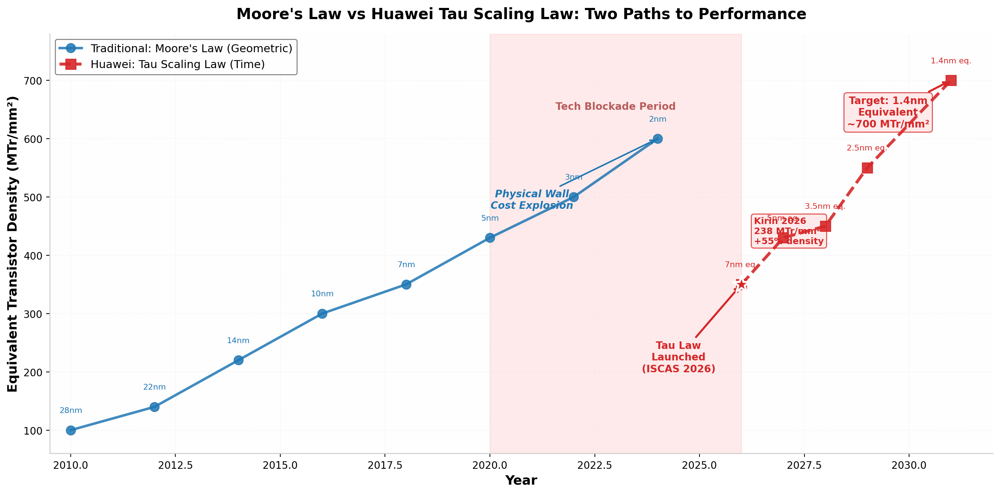

# 华为韬（τ）定律深度研究报告：半导体产业新范式的技术突破与产业链重构

## 核心摘要

**2026年5月25日，华为公司董事、半导体业务部总裁何庭波在IEEE ISCAS 2026国际研讨会上正式发表"韬（τ）定律"**——这是中国企业在全球半导体领域首次提出的产业发展指导原则。[^27^] 韬定律的核心主张是以**"时间缩微（Time Scaling）"替代传统的"几何缩微（Geometric Scaling）"**，通过系统性降低电路时间常数τ（信号传播时延），在不依赖EUV极紫外光刻机推进到更先进制程的前提下，实现晶体管密度与系统性能的持续提升。[^28^][^31^] 华为披露，过去六年已基于该定律成功设计并量产**381款芯片**，覆盖移动通信、AI、汽车和基础设施市场。[^43^] 即将于2026年秋季发布的麒麟芯片将首次完整采用"逻辑折叠"核心技术，实现**晶体管密度55%的阶跃式提升和41%的能效增益**——这一幅度此前需要三年的几何缩微才能实现。[^77^] **预计到2031年，基于韬定律的高端芯片晶体管密度将达到1.4纳米制程的同等水平**。[^38^]

从产业影响来看，韬定律的战略意义远超单一技术突破。它将全球半导体竞争从**"谁制程更先进"的单维赛道**，切换至**"制程+架构+系统协同"的多维竞争格局**。[^133^] 对于被先进制程卡脖子的中国半导体产业而言，韬定律提供了一条**不依赖EUV光刻机、经济上可行**的突围路径，直接利好先进封装、成熟制程代工、国产半导体设备与材料、EDA工具等四大产业链环节。[^130^] 据Yole统计，2024年全球先进封装市场规模已达**450亿美元**，预计到2030年将升至**800亿美元**，其中2.5D/3D封装的年复合增长率高达**18%**。[^173^] 韬定律的发布，正在成为这一增长趋势的重要催化剂。

---

## 1. 韬定律技术原理深度解析

### 1.1 从几何缩微到时间缩微：范式转换的本质

半导体产业过去六十年的发展，本质上是一部**几何缩微**的历史。1965年，英特尔创始人戈登·摩尔提出摩尔定律，预测集成电路上晶体管数量每18-24个月翻一番。[^86^] 这一预测的核心物理基础是：通过不断缩小晶体管的物理尺寸（栅极长度L），在同等面积内塞入更多晶体管，从而提升密度、速度和能效。从28nm到14nm、7nm、5nm、3nm，再到台积电正在推进的2nm，每一代制程的进步都意味着晶体管尺寸的等比例缩小。

然而，这条路径正面临**三重根本性瓶颈**。

**第一重瓶颈是物理极限**。当晶体管尺寸逼近原子级别（3nm节点单个晶体管仅由数百个原子构成），量子隧穿效应导致漏电流呈指数级增长，栅极对沟道的控制能力急剧下降。[^138^] 根据IEEE IEDM会议的分析，从5nm到3nm再到2nm，每一代的技术壁垒呈指数级攀升，而性能增益却递减。

**第二重瓶颈是经济成本**。根据行业数据，**5nm芯片的研发费用高达5.4亿美元，是28nm制程的10倍**；建设一条先进的2nm晶圆制造产线需要**超过200亿美元**的投资。[^176^] 摩尔第二定律（洛克定律）指出，半导体制造工厂的资本成本随时间呈指数级增长。[^158^] 这种"成本墙"使得只有极少数厂商（台积电、三星、英特尔）有能力参与最前沿制程的竞争。

**第三重瓶颈是登纳德缩放定律的终结**。1974年，IBM研究员罗伯特·登纳德提出的缩放定律指出，随着晶体管尺寸缩小，功率密度可保持不变——这使得芯片制造商能够在不增加功耗的前提下提高时钟频率。[^138^] 然而，大约在**2005-2007年间**，当工艺进入65nm及以下节点时，量子隧穿效应引发的漏电流使得工作电压无法再按比例降低，登纳德缩放定律失效。[^137^][^142^] 结果是：晶体管密度仍在增加，但**功耗密度急剧攀升**，芯片性能提升越来越受限于供电和散热能力——这就是著名的"功耗墙"。

在这样的背景下，华为提出的韬定律代表了一种**根本性的范式转换**。

| 维度 | 摩尔定律（几何缩微） | 韬定律（时间缩微） |
|------|---------------------|-------------------|
| **核心变量** | 晶体管物理尺寸L（栅极长度） | 时间常数τ（RC延迟 = 电阻×电容） |
| **优化目标** | 缩小几何尺寸，提升单位面积晶体管数 | 压缩信号传播时延，提升等效密度 |
| **关键手段** | EUV光刻、FinFET/GAA晶体管 | 逻辑折叠、3D堆叠、系统协同 |
| **制程依赖** | 高度依赖最先进制程节点 | 可在成熟制程（7nm/14nm/28nm）实现 |
| **性能指标** | 晶体管密度（MTr/mm²） | 端到端执行时间、频率、能效 |
| **成本结构** | 超高（200亿+美元/产线） | 相对较低（复用成熟产线） |
| **适用场景** | 全球头部厂商（台积电/三星/英特尔） | 被封锁/无EUV条件下的替代路径 |

这一转换的工程意义在于：**影响τ的变量远多于几何尺寸**。τ = R × C（电阻×电容），而电阻R受互连线材料、布线拓扑、通孔密度影响，电容C受层间介质、寄生参数、堆叠结构影响。[^34^] 这意味着优化维度从一维（缩小L）扩展至多维（材料、拓扑、架构、系统协议），为性能提升开辟了全新的设计空间。

### 1.2 核心技术：逻辑折叠（Logic Folding）

逻辑折叠是实现韬定律的**核心技术抓手**。要理解其原理，需要先了解传统芯片设计的根本局限。

传统芯片的电路布局本质上是**二维平面**的。尽管晶体管本身在FinFET和GAA架构中已经实现了三维化，但金属互连线（负责在晶体管之间传输信号）仍然被约束在近乎二维的平面上绕行。[^39^] 当芯片规模扩大时，关键信号传输路径变得越来越长，导致RC延迟（τ）急剧增加。在7nm及以下的先进制程中，**互连延迟已占到芯片总延迟的70%以上**，而非晶体管本身的开关延迟。[^45^]

逻辑折叠的技术原理可以类比为**城市交通规划**。传统方法相当于在二维平面上不断缩窄道路和建筑以塞入更多人口（几何缩微），而逻辑折叠则是在城市规模不变的前提下，修建多层立交桥和地下通道，把经常往来的功能区挪得更近，从而缩短通勤时间（时间缩微）。[^28^][^42^]

具体而言，逻辑折叠通过以下机制实现τ的压缩：

**第一层机制：缩短关键路径的物理距离**。将平面上分散布局的ALU（算术逻辑单元）、寄存器堆、控制单元等关键模块，通过**垂直堆叠**的方式重新排布。何庭波在论文中披露，在麒麟2026的实践中，混合键合间距为1.5μm， selectively应用于关键路径，使得**时钟缓冲器减少50%以上，时钟偏移降低25%，布线长度缩短约30%**。[^54^]

**第二层机制：多层活动层堆叠**。未来十年，逻辑折叠预计将从局部关键路径折叠演进为**全规模、多层级折叠架构**——每个封装内集成三层、四层甚至更多活动层。[^75^] TSV（硅通孔）落点从顶层金属层下移至M6金属层，可释放超过30%的高层布线资源。预计到2026-2035年，晶体管密度将达到**400 MTr/mm²甚至更高**。[^71^]

**第三层机制：3D折叠解决扇出困境**。在AI数据中心场景中，计算能力按N²增长，而周长绑定的带宽/I/O/供电仅按N线性增长，这构成了"扇出困境（fan-out dilemma）"。[^62^] 3D折叠通过将带宽、光学I/O和供电从边缘重新布局到表面，恢复了N²的对等缩放能力。

### 1.3 四层级协同优化体系

韬定律并非单一技术点突破，而是一个**贯穿器件、电路、芯片到系统的全栈协同优化体系**。四个层级像齿轮一样咬合在一起，共同驱动τ的系统性缩微。[^43^][^51^]

**器件层（Device Layer）** 是整个体系的物理地基。通过优化晶体管和互连的电阻（R）及寄生电容（C），从物理底层最大限度缩微器件级时间常数τ。这包括从平面MOSFET到FinFET再到GAA（环绕栅极）晶体管的结构演进，以及新型互连材料（如钴替代铜、低k介质）的引入。[^41^]

**电路层（Circuit Layer）** 是逻辑折叠技术落地的核心战场。通过将平面电路"折叠"为双层乃至多层结构，突破传统平面布局的物理边界，显著缩短关键路径走线长度。在麒麟2026上，这一层实现了**晶体管密度55%的阶跃式提升和41%的能效增益**。[^38^]

**芯片层（Chip Layer）** 引入"软件+架构+芯片"的全栈软硬芯协同设计。基于实际工作负载实现指令流和数据流的细粒度控制，让芯片"只算必须算的东西"，减少无效开销，把端到端的执行时间压到最低。[^28^]

**系统层（System Layer）** 定义了**"灵衢总线（Lingqu Bus）"**，重构计算系统互联协议，实现超节点的统一内存编址和原生内存语义。何庭波论文披露，Unified Bus将端到端延迟从**数十微秒压缩到约100纳秒，实现约500倍的τ缩减**。[^56^] 此外，近封装光引擎**Hi-ONE**提供每模块**8Tb/s**的带宽，SerDes传输距离从约100cm缩短到约5cm。[^67^]

---

## 2. 量产验证与产品路线图

### 2.1 六年381款芯片的量产实践

韬定律最具说服力的地方在于，它并非实验室概念，而是已经经过**大规模量产验证**的工程方法论。何庭波在论文中披露，从2020年5月至2026年5月，华为半导体团队已设计并量产了**381款芯片**，广泛覆盖移动通信、人工智能、汽车电子、工业和基础设施市场。[^43^][^55^]

这一量产规模意味着韬定律的技术路径已经跑通了从设计到制造的完整闭环。381款芯片构成了一个**可核实的工程证明**，而非停留在纸面上的理论构想。[^133^] 更重要的是，这些芯片是在美国技术封锁的极端条件下完成的——自2019年5月华为被列入实体清单、2020年9月台积电断供、2022年10月先进EDA工具禁令升级以来，华为海思团队被迫在"无先进制程、无先进EDA、无先进代工"的三重约束下寻找突围路径。[^121^]

### 2.2 麒麟手机芯片路线图

麒麟芯片是韬定律在移动终端领域的旗舰应用。根据何庭波论文披露的路线图：[^53^][^57^]

| 芯片型号 | 发布时间 | CPU P核频率 | 状态 | 关键特性 |
|----------|---------|------------|------|----------|
| 麒麟9000S | 2023年8月 | ~2.5 GHz | 量产 | 中芯国际7nm工艺，首款国产先进制程手机SoC [^121^] |
| 麒麟9030 Pro | 2025年 | 2.75 GHz | 量产 | 半代升级产品 [^72^] |
| **麒麟2026** | **2026年秋** | **3.1 GHz** | **Silicon验证** | **首款完整逻辑折叠，密度+55%，能效+41%** [^31^][^77^] |
| 麒麟2027 | 2027年 | 3.39 GHz | Silicon（已流片） | 延续逻辑折叠架构 [^73^] |
| 麒麟2028 | 2028年 | 3.71 GHz | Pre-silicon | 全规模多层折叠 [^57^] |
| 麒麟2029 | 2029年 | >4.0 GHz | Pre-silicon | 三层+活动层，4GHz+目标 [^53^] |

值得注意的变化是芯片命名规则的改变——从传统的"9系数字迭代"（如9000、9010、9020）改为**"麒麟+年份"**的命名方式。[^73^] 这可能意味着华为正在建立一个全新的产品序列，以匹配韬定律驱动的年度迭代节奏。在状态栏中，不仅麒麟2026处于Silicon阶段，**麒麟2027也标注为Silicon状态**，表明研发已取得实质进展。[^71^]

### 2.3 昇腾AI芯片路线图

在AI数据中心领域，韬定律的应用将带来更深远的影响。昇腾AI加速器的演进路线分为两个阶段：[^56^][^62^]

**第一阶段（2025-2030年）：成熟技术组合**。昇腾910C（2025年）、昇腾950（2026年）以及后续的昇腾990，将采用**Chiplet芯粒、2.5D扇出封装、微凸点混合键合3D堆叠**等成熟技术的组合。这一阶段的目标是通过成熟的先进封装技术快速提升AI算力密度。

**第二阶段（2030年前后）：逻辑折叠引入AI加速器**。大约在2030年，**昇腾990将把逻辑折叠技术引入AI加速器类别**，从那时起3D折叠成为2035年前α缩放的主要载体。沿此路径，到2035年硬件集成度预计将增长**100倍以上**，τ的降低将分布在堆栈的每一层，而非集中在器件层面。[^56^]

| 芯片型号 | 时间 | 封装技术 | 逻辑折叠 | 目标 |
|----------|------|---------|---------|------|
| 昇腾910C | 2025年 | Chiplet + 2.5D扇出 | 否 | AI算力基础平台 |
| 昇腾950 | 2026年 | 3D堆叠（微凸点混合键合） | 否 | 算力密度提升 |
| **昇腾990** | **~2030年** | **3D折叠（Logic Folding）** | **是** | **100倍硬件集成度增长** [^47^] |

在系统互联层面，**Unified Bus（统一总线）** 将远程访问延迟从约数十微秒压缩到约100纳秒（约500倍τ缩减），**Hi-ONE光学I/O** 每模块提供8Tb/s带宽。[^67^] 这些系统级创新，使得韬定律不仅适用于单颗芯片，还能扩展到整个AI数据中心的规模。

---

## 3. 全球技术路线对比：韬定律 vs 传统路径

### 3.1 摩尔定律的演变与后摩尔时代格局

要理解韬定律在全球半导体版图中的定位，需要回顾摩尔定律的演变历程及其面临的挑战。

1965年，戈登·摩尔在《电子学》杂志上发表文章，观察到集成电路上晶体管数量每年翻一番，预测这一趋势将至少持续十年。[^86^] 1975年，摩尔将预测修正为**每24个月翻一番**。[^83^] 这一预测在接下来的五十年里惊人地准确——从1971年英特尔4004处理器的2,300个晶体管，到2024年英伟达Blackwell GPU的**2,080亿个晶体管**，晶体管数量增长了约9个数量级。[^83^][^140^]

然而，维持摩尔定律的"魔法配方"不仅仅是晶体管数量的增长，而是**摩尔定律+登纳德缩放定律**的共同作用。登纳德缩放保证了在塞入更多晶体管的同时，可以通过提高时钟频率来提升性能，而无需担心功耗失控。[^141^] 当登纳德缩放在2005年失效后，业界被迫转向多核架构、专用加速器（如GPU/TPU）、以及后来的先进封装（Chiplet/3D IC）等替代路径。

目前，全球头部厂商维持性能增长的技术路线可以归纳为以下几类：

| 技术路线 | 代表厂商 | 核心策略 | 制程依赖 | 成本 | 成熟度 |
|----------|---------|---------|---------|------|--------|
| **先进制程微缩** | 台积电、三星、英特尔 | 持续缩小晶体管尺寸（2nm→1.4nm） | 极高（EUV必需） | 极高 | 成熟但趋缓 |
| **Chiplet异构集成** | AMD、英特尔、苹果 | 将大芯片拆分为小芯片，2.5D/3D封装 | 中等 | 中等 | 成熟 |
| **先进封装（CoWoS/SoIC）** | 台积电、日月光 | 硅中介层、混合键合、TSV | 中等 | 中高 | 快速成熟 |
| **新型晶体管结构** | 三星、英特尔 | GAA、CFET等 | 高 | 高 | 研发中 |
| **背面供电（BSPDN）** | 英特尔、台积电 | 从背面供电，减少正面拥堵 | 高 | 高 | 2026+量产 |
| **光计算/光互连** | Ayar Labs、英伟达 | 用光信号替代电信号传输 | 低-中 | 中 | 早期 |
| **韬定律（时间缩微）** | **华为** | **逻辑折叠+系统协同，压缩τ** | **低（7nm即可）** | **中** | **已量产验证** |

### 3.2 英伟达/AMD/英特尔 vs 华为技术路线对比

在AI芯片这一最具战略价值的赛道上，各厂商的技术路线差异尤为显著。

**英伟达**代表了传统的"制程+架构"双轮驱动模式。Blackwell Ultra（2025年）采用台积电4NP工艺，集成**2080亿个晶体管**，配备192GB HBM3E显存。[^140^] 下一代Rubin（2026年）进一步升级至台积电3nm工艺，晶体管数量达到**3360亿**，配备288GB HBM4，FP4推理算力达50 PFLOPS（Blackwell的5倍）。[^165^][^168^] 英伟达的优势在于CUDA生态系统和全栈软件栈，但其性能提升高度依赖台积电最先进的制程节点。

**AMD**紧随其后，Instinct MI350系列（2025年）采用3nm CDNA 4架构，配备288GB HBM3E，相比MI300系列AI推理性能提升约**35倍**。[^120^] MI355X作为旗舰型号功耗达1400W，面向高密度计算环境。[^120^] AMD同样依赖台积电先进制程，但通过与Broadcom、Meta等组建UALink联盟，试图打破英伟达NVLink的互联垄断。[^104^]

**华为昇腾**则走出了截然不同的路线。在无法获得台积电最先进制程的情况下，华为选择在**中芯国际7nm成熟制程**的基础上，通过韬定律的四层级协同优化和逻辑折叠技术实现性能跃升。[^110^] 虽然单颗芯片的绝对算力可能暂时落后，但**系统级的τ优化**（Unified Bus 500倍延迟缩减、Hi-ONE 8Tb/s光互连）有望在大规模集群场景下缩小差距。

### 3.3 台积电/三星/英特尔先进封装路线对比

先进封装是后摩尔时代所有厂商的共同选择，但技术路线各有侧重。

**台积电**在先进封装领域处于绝对领先地位。其**CoWoS（Chip-on-Wafer-on-Substrate）** 已成为AI芯片的事实行业标准——英伟达H100/H200/GB200、AMD MI300系列、谷歌TPU等均采用CoWoS封装。[^79^] 据摩根大通报告，台积电CoWoS产能预计2026-2028年底分别达到**11.5万、15.5万、17.5万片/月**。[^79^] 在3D封装方面，台积电的**SoIC（System-on-Integrated-Chips）** 技术将互连间距从当前的6微米缩小到2029年的**4.5微米**，A14-to-A14 SoIC预计2029年量产。[^98^] 下一代**CoPoS（面板级封装）** 中试线预计2026年上半年就绪，2028年进入量产。[^81^]

**英特尔**通过**Foveros 3D封装**和**EMIB 2.5D封装**积极追赶。2024年，英特尔宣布Foveros实现大规模量产，并计划在马来西亚槟城建设其最大的3D先进封装据点，到2025年产能提升至当前的四倍。[^90^][^91^] 英特尔的优势在于可以提供"系统级代工"服务——不仅供应晶圆，还提供硅片、封装、软件和芯粒等全栈服务。[^96^]

**三星电子**也在积极争夺市场份额，但面临较大压力。近期谷歌和高通等客户转向台积电，使三星倍感压力。[^82^] 从专利数量看，台积电拥有**2,946项**先进封装专利，三星**2,404项**，英特尔**1,434项**。[^82^]

| 厂商 | 2.5D封装 | 3D封装 | 混合键合 | 面板级封装 | 关键客户 |
|------|---------|--------|---------|-----------|---------|
| **台积电** | CoWoS-S/L/R | SoIC (6μm→4.5μm) | 已量产 | CoPoS (2028) | 英伟达、AMD、谷歌、博通 [^79^][^98^] |
| **英特尔** | EMIB | Foveros (36μm→<20μm) | Foveros Direct | 玻璃基板研发 | 微软、AWS、思科 [^87^][^91^] |
| **三星** | I-Cube | X-Cube | 研发中 | 研发中 | 内部、部分外部 [^82^] |
| **华为/国产** | 通富微电、长电科技 | 长电XDFOI | 长电/华天研发 | 早期布局 | 华为海思、国内客户 [^130^] |

韬定律的独特之处在于，它将先进封装从**"性能补充手段"**提升到了**"核心性能驱动力"**的地位。在传统的芯片设计流程中，封装是"后道"环节，主要负责保护和连接芯片。而在韬定律框架下，**逻辑折叠本质上是芯片内部架构的重新设计**，先进封装（3D堆叠、混合键合、TSV）成为实现这一架构创新的必要前提。[^34^]

---

## 4. 韬定律对芯片产业链的重构性影响

### 4.1 产业链价值重心转移：从"前道制程"到"后道封装+设计"

韬定律的发布正在引发半导体产业链**价值重心的结构性转移**。在传统模式下，芯片性能提升的主要贡献来自前道制程（晶圆制造）——更先进的 lithography（光刻）、更精密的刻蚀、更薄的沉积。封装作为"后道"环节，价值占比相对较低。

韬定律改变了这一格局。当性能提升的核心驱动力从"缩小晶体管"转向"三维堆叠+系统协同"时，**先进封装、EDA工具、系统架构设计**的价值权重显著上升。[^133^] 据Yole预测，2024年全球先进封装市场规模达**450亿美元**，占整体封装市场比重超**55%**；2.5D/3D封装营收年复合增速达**18.05%**，远高于行业平均增速。[^173^]

这一转移对中国半导体产业具有特殊的战略意义。在传统的制程竞赛中，中国最先进的量产制程是中芯国际的7nm（N+2），而台积电已量产2nm，差距约2-3代。[^121^] 但在"时间缩微"的新赛道上，竞争坐标系从"谁的制程更先进"切换至"谁的系统性能更优"，而**系统级优化所需的EDA工具、电路设计能力、先进封装能力中，有相当部分是中国已有或可自研的能力**。[^133^]

### 4.2 先进封装：从"配角"到"主角"

韬定律落地的核心手段是逻辑折叠，而这必须依赖**2.5D/3D堆叠、Chiplet异构集成**等先进封装技术。这使得先进封装从传统的"后道配角"一跃成为决定芯片性能的核心工艺，是整个产业链中最直接、最强的受益主线。[^130^]

**混合键合（Hybrid Bonding）** 被视为3D封装的终极技术。它通过铜对铜的原子级直接贴合，将芯片间互连间距缩小到微米级甚至亚微米级，从而大幅提升连接密度和带宽、降低功耗。[^81^] 在HBM高带宽内存领域，混合键合已从"技术选项"变为"生存必需"——三星、美光、SK海力士三大存储巨头明确宣布：**HBM5 20Hi必须采用混合键合技术**。[^81^]

据何庭波论文披露，华为在麒麟2026上采用的混合键合间距为**1.5μm**，属于选择性应用（仅针对关键路径），尚未在全设计铺开。[^54^] 但这一保守应用已经取得了显著效果。未来随着技术成熟，混合键合间距将进一步缩小，TSV落点从顶层金属层下移至M6金属层，释放超过30%的高层布线资源。[^75^]

### 4.3 成熟制程代工的"第二春"

韬定律的一个重要战略含义是：**成熟制程（7nm/14nm/28nm）重新变得"性感"**。[^40^] 在传统逻辑下，只有最先进的制程节点才具有商业价值，成熟制程面临产能过剩和价格战的压力。但韬定律证明，通过架构创新和系统优化，成熟制程芯片可以实现匹敌甚至超越部分先进制程芯片的实际性能。

对于**中芯国际**而言，这是重大利好。中芯国际是国内最大的晶圆代工厂，7nm N+2工艺是华为当前最先进的可用制程。[^110^] 据产业链消息，中芯国际正加速提升7纳米先进制程产能，计划在2026年实现该节点产能翻番。[^110^] 同时，三座专为华为代工AI处理器的晶圆厂正在加紧建设，首座工厂最快将于2025年底投产。[^110^] 在成熟制程方面，中芯国际2025年成熟制程总产能有望突破**200万片/月**（折合8英寸），占据全球28nm市场**35%**份额。[^171^]

韬定律的"成熟制程+逻辑折叠"路线，使得中芯国际的产能价值被重新评估。2026年5月25日韬定律发布当天，中芯国际A股涨幅达**18.78%**——市场不是在为一篇学术论文买单，而是在为一条**绕开先进光刻设备限制的量产路径**买单。[^77^]

### 4.4 国产EDA：三维设计的新刚需

韬定律对EDA工具链提出了全新要求。传统的芯片设计EDA主要面向二维平面布局，而逻辑折叠需要支持**三维集成、跨层级协同优化、多层堆叠物理验证**等全新功能。[^134^]

**华大九天**是国内EDA领域的绝对龙头，市场份额约**9%**，位居本土企业首位。[^115^] 公司已形成模拟/数模混合IC设计全流程、数字SoC设计优化、晶圆制造专用工具及平板显示设计等完整解决方案。在3DIC领域，华大九天推出了**Argus3DIC物理验证平台**，填补国内高端3DIC设计工具空白，支持2.5D/3D异构集成封装全链路验证。[^102^] 其先进封装EDA平台可将人工设计周期缩短**60%**。[^102^]

**概伦电子**在器件建模和电路仿真等"点工具"上达到国际水平，其SPICE仿真精度达到国际主流水平，获得台积电N6工艺认证。[^111^] **广立微**专注于芯片成品率提升和电性测试快速监控技术，在复杂三维芯片设计的成品率控制方面具有独特价值。[^134^]

然而，国产EDA仍面临**全流程覆盖能力不足**的挑战。全球市场被Synopsys、Cadence、Siemens EDA三巨头垄断（合计占**74%**以上），国产EDA在数字芯片全流程、高端验证工具等关键环节仍有明显差距。[^112^] 韬定律带来的三维设计需求，既是国产EDA的替代机遇，也是技术能力的严峻考验。

### 4.5 半导体设备：从"平面刻蚀"到"3D结构加工"

实现逻辑折叠、3D堆叠等"时间缩微"技术，需要更高深宽比的刻蚀、更精密的薄膜沉积、更复杂的层间对准。[^40^] 以3D逻辑堆叠为例，需要在高深宽比（>60:1）的硅通孔刻蚀中实现极高均匀性，这对刻蚀设备和原子层沉积（ALD）设备提出了指数级的要求。

**北方华创**是国内半导体设备平台型龙头，2025年营业收入**393.53亿元**，同比增长**30.85%**。[^131^] 公司产品覆盖刻蚀、薄膜沉积、热处理、湿法清洗、离子注入、电镀、键合等全系列核心工艺装备。在先进封装领域，北方华创的**12英寸深硅刻蚀设备**专门用于2.5D/3D先进封装硅通孔（TSV）刻蚀，其**12英寸先进封装金属沉积设备（PVD）**和**原子层沉积设备（ALD）**已进入多家头部客户的批量采购清单。[^131^]

**中微公司**是国内刻蚀设备绝对龙头，其CCP/ICP刻蚀机在多家主流晶圆厂量产，是解决3D堆叠高密度互连工艺的刚需设备。**盛美上海**的清洗设备和电镀设备是先进封装产线不可或缺的环节。**华海清科**的CMP（化学机械抛光）设备则满足3D堆叠对晶圆表面平整度的极高要求。[^130^]

据北方华创年报披露，2025年全球半导体封装设备销售额达**64亿美元**，同比增长**19.6%**，2026年和2027年将继续增长**9.2%**和**6.9%**。[^131^] 驱动力正是来自先进封装、异构集成的加速渗透。

---

## 5. 产业链投资分析：六大受益主线

### 5.1 投资逻辑框架

韬定律对半导体产业链投资逻辑的重构，可以用一个核心等式来概括：

> **传统逻辑**：性能提升 = f(制程节点) → 投资焦点 = 先进制程代工 + EUV光刻机
> **韬定律逻辑**：性能提升 = f(τ缩微) = f(逻辑折叠, 系统协同, 封装技术, EDA工具) → 投资焦点 = **先进封装 + 成熟代工 + 国产设备 + EDA/IP**

这一逻辑转换意味着，**在先进制程被封锁的背景下，中国半导体产业的价值创造正从"制程追赶"转向"架构创新"**。[^132^] 以下六大投资主线构成了韬定律落地的核心受益版图。

### 5.2 主线一：先进封装——最直接、最强的受益者

先进封装是韬定律落地的**物理载体**。逻辑折叠的本质是把平面电路"竖起来"，让信号从横向长距离传输变成纵向短距离穿梭——这直接要求高密度、低互连时延的封装技术。[^40^]

| 标的 | 代码 | 核心优势 | 与韬定律的关联 |
|------|------|---------|--------------|
| **长电科技** | 600584 | 全球第三大封测龙头，XDFOI高密度封装和3D堆叠技术 | 华为麒麟、昇腾主力封测供应商，逻辑折叠核心产能承接方 [^130^] |
| **通富微电** | 002156 | 国内领先封测厂商，2.5D/3D异构封装技术积累深厚 | 深度绑定华为，先进封装订单爆发式增长 [^130^] |
| **华天科技** | 002185 | 国内封测前三，三维封装与异构集成能力突出 | 西安基地就近配套华为，多芯片堆叠优势明显 [^130^] |
| **甬矽电子** | 688362 | 先进封装新锐，FC-BGA、2.5D/3D异构封装 | 华为先进封装重要合作方，业绩弹性高 [^130^] |

据上海证券报援引专家分析，2025年全球先进封装市场规模约**531亿美元**，预计2030年达**794亿美元**，2.5D/3D封装年复合增长率高达**37%**。[^133^] 韬定律在华为内部的持续推进，将为国内封装产业提供稳定的高端需求锚点。

### 5.3 主线二：成熟制程代工——产能价值重估

韬定律不依赖3/2nm，重点在7/14/28nm+逻辑折叠，**成熟制程反而更吃香**。[^40^] 中芯国际是国内最大的头部晶圆厂，N+2/7nm与华为深度协同。3D堆叠的前道部分需要晶圆与晶圆之间完成混合键合与超薄处理，这正是中芯国际正在强化的能力。

| 标的 | 代码 | 核心优势 | 与韬定律的关联 |
|------|------|---------|--------------|
| **中芯国际** | 688981 | 国内最大晶圆代工厂，7nm N+2已量产 | 华为最大代工伙伴，7nm产能规划翻倍 [^110^][^171^] |
| **华虹半导体** | 1347.HK | 特色工艺代工龙头，功率半导体、MCU | 28nm/40nm产能扩张，承接韬定律外溢需求 |

### 5.4 主线三：半导体设备——3D结构加工的新需求

"几何缩微"时代，设备追求的是"更细的线宽"；"时间缩微"时代，设备追求的是"更复杂的三维结构"。[^40^] 前者靠光刻机，后者靠**刻蚀+薄膜沉积+量测**的协同突破。

| 标的 | 代码 | 核心优势 | 与韬定律的关联 |
|------|------|---------|--------------|
| **北方华创** | 002371 | 平台型设备龙头，刻蚀/薄膜沉积/键合全覆盖 | TSV刻蚀、ALD、PVD是3D堆叠核心设备 [^131^] |
| **中微公司** | 688012 | 刻蚀设备龙头，CCP/ICP量产 | 3D堆叠高密度互连工艺刚需 [^130^] |
| **盛美上海** | 688082 | 清洗+电镀设备龙头 | 先进封装产线不可或缺的环节 [^130^] |
| **华海清科** | 688120 | CMP抛光设备龙头 | 3D堆叠对平整度要求极高 [^130^] |

北方华创2025年研发投入达**72.77亿元**，同比增长**34.74%**，累计申请专利超**11,300件**。[^131^] 公司已成功推出离子注入设备、电镀设备、混合键合设备等多款新产品，产品矩阵进一步完善。

### 5.5 主线四：国产EDA——三维设计的刚需

韬定律下的芯片设计从"平面布局"转向"三维折叠"，对支持三维集成、系统级优化的全新EDA工具提出了刚性需求。[^134^]

| 标的 | 代码 | 核心优势 | 与韬定律的关联 |
|------|------|---------|--------------|
| **华大九天** | 301269 | 唯一覆盖模拟/数字/存储/射频/3D IC全流程EDA | Argus3DIC填补国内3DIC验证空白，支撑三维设计 [^102^][^134^] |
| **概伦电子** | 688206 | 器件建模和电路仿真国际水平 | SPICE仿真获台积电N6认证 [^111^] |
| **广立微** | 301095 | 成品率提升和电性测试监控 | 支撑复杂三维芯片量产良率控制 [^134^] |
| **芯原股份** | 688521 | 半导体IP平台型龙头 | GPU/NPU IP已出货超1亿颗 [^112^] |

### 5.6 主线五：材料与零部件——底层国产化

| 标的 | 代码 | 核心优势 | 与韬定律的关联 |
|------|------|---------|--------------|
| **沪硅产业** | 688126 | 300mm大硅片龙头，良率突破95% | 进入中芯国际28nm供应链 [^111^] |
| **鼎龙股份** | 300054 | 混合键合表面处理核心耗材 | 混合键合工艺重要组成部分 [^134^] |
| **华特气体** | 688268 | 电子特气龙头，高纯六氟乙烷99.9999% | 填补国内技术空白 [^111^] |
| **华海诚科** | 688535 | 先进封装材料（环氧塑封料） | 通过长电科技认证 [^111^] |

### 5.7 主线六：AI算力芯片——终端受益者

| 标的 | 代码 | 核心优势 | 与韬定律的关联 |
|------|------|---------|--------------|
| **海光信息** | 688041 | 国产x86 CPU/DCU龙头 | 受益于国产算力生态 [^130^] |
| **寒武纪** | 688256 | 国产AI芯片领军者 | AI大模型训练与推理核心硬件 [^130^] |
| **兆易创新** | 603986 | 存储与MCU龙头 | 近存计算协同发展 [^130^] |

---

## 6. 风险与挑战：理性看待韬定律

### 6.1 技术局限性

尽管韬定律提供了不依赖先进制程的替代路径，但**设计层面的优化有其物理上限**。在对制程高度敏感的场景（如超大规模AI训练芯片），物理晶体管密度的绝对值仍然决定算力天花板。[^133^] 英伟达Rubin的3360亿晶体管（3nm）与华为昇腾990在7nm制程下的晶体管数量，存在数量级的差距，这一差距无法仅通过架构创新完全弥补。

此外，逻辑折叠带来的**散热挑战**不容忽视。当多层有源层垂直堆叠时，热量散发路径变得更加复杂。台积电已在2025年展示了**硅集成微通道冷却系统（IMC-Si）**，通过SoIC晶圆键合技术在芯片背面制造微柱阵列，冷却液直接接触热源。[^93^] 但这类散热方案增加了系统复杂性和成本。

### 6.2 产业链协同挑战

韬定律的四层级协同优化要求**器件、电路、芯片、系统**四个层面的深度协同，这对产业链的协作能力提出了极高要求。[^43^] 华为之所以能够推进这一体系，是因为其拥有从芯片设计（海思）、系统架构（鸿蒙）、终端产品（手机/服务器）到通信网络（5G/6G）的**垂直整合能力**。对于缺乏这种全栈能力的厂商而言，复制韬定律的难度较大。

在EDA工具方面，华为当前仍**高度依赖外部工具**（受出口管制影响），这是其最薄弱的环节。[^133^] 国产EDA虽然取得了长足进步，但在数字芯片全流程、高端验证、先进工艺适配等方面与国际三巨头仍有显著差距。

### 6.3 全球竞争格局的不确定性

韬定律的提出是否构成半导体领域"重新定义问题"的时刻，**现在判断为时尚早**——因为它的技术主张需要到2031年才有完整验证。[^133^] 全球半导体性能演进的叙事框架，将从台积电/英特尔/三星三方定义演变为四方乃至多方并存的状态，但这种多极格局能否稳定，取决于各技术路线的实际量产表现。

---

## 7. 结论与展望

华为韬（τ）定律的发布，标志着中国半导体产业从**被动跟随摩尔定律**转向了**主动引领系统级创新**的新范式。[^130^] 这一转变的战略价值体现在三个层面：

**第一，技术层面**。韬定律以"时间缩微"替代"几何缩微"，通过逻辑折叠、系统协同和先进封装，在成熟制程上实现了等效于先进制程的性能提升。381款量产芯片的工程实践证明了这一路径的可行性。

**第二，产业层面**。韬定律打破了西方在极限制程上的垄断枷锁，为中国芯片产业打开了广阔的内循环空间。先进封装、成熟制程代工、国产半导体设备与材料构成了确定性最强的三大受益阵地。

**第三，全球格局层面**。韬定律将中国纳入全球半导体性能演进的"定律制定者"行列，推动竞争从单维制程竞赛扩展为多维系统性能竞赛。

从投资角度看，**先进封装**是韬定律落地的最直接受益者，**中芯国际**等成熟制程代工厂的产能价值将被重估，**北方华创**等设备厂商将在3D结构加工的新需求中获得增量订单，**华大九天**等国产EDA厂商将在三维设计的新刚需中迎来替代机遇。这些赛道构成了"韬定律时代"半导体投资的核心版图。

但投资者也需保持理性。半导体行业具有**长周期、高研发投入**的特性，相关公司的业绩兑现需要时间的检验。[^130^] 韬定律到2031年的完整验证仍面临技术、产业链协同和全球竞争的不确定性。在这一过程中，能够持续跟踪华为芯片量产进展、国产供应链成熟度以及全球技术路线演进节奏的投资者，将更有可能把握这一轮产业变革的投资机遇。
